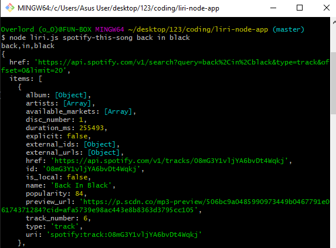
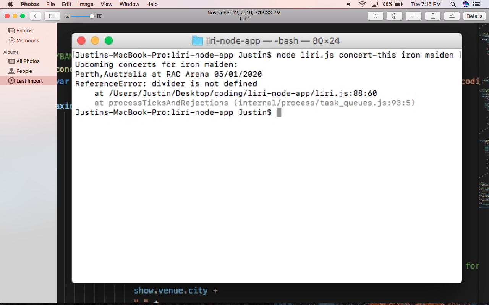

# liri-node-app
Shows the app working and asking the use to input a valid command.

Shows liri using OMDB API to call a specificMovie

Shows liri using spotify to call out a specific song

Shows liri using BandsInTown API (This was done in the mac which is borrowed. Thats the reason it has a differnt name) 

